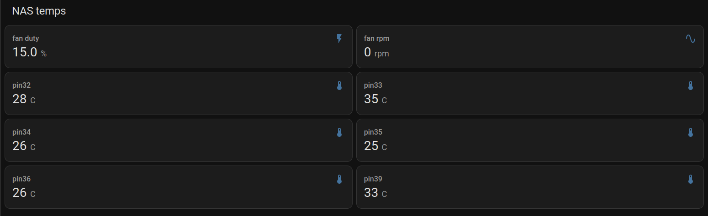

# esp32-mpy-pwm-fan-controller
MQTT-Enabled PWM Fan Controller with Thermistors and MicroPython on ESP32

# Disclamer
I am a hobbyist and not a professional when it comes to electronics or programming. While I try to ensure accuracy, there may be mistakes or suboptimal choices in my work. Please use this as a learning resource, and feel free to offer corrections or suggestions for improvement!

# Background
The purpose of this repository is to document, share, and hopefully polish over time an ESP32-based MicroPython PWM fan controller using thermistors. I created this project to monitor the temperatures of up to six hard drives in my DIY NAS.

In most PCs, fans are controlled based on CPU or GPU temperatures, but that’s not ideal for managing HDD temperatures. In my NAS, the drives usually idle cool, but during operations like scrubs or backups—where several terabytes of data are read continuously—they start heating up. That’s where this controller comes in: it monitors HDD temps and ramps up dedicated fans as needed to keep them in a safe range.

The system publishes fan duty, RPM, and temperature readings over MQTT, allowing integration with platforms like Home Assistant for monitoring and automation.

# Schematics
[Fritzing schematic file](schematics/schematics.fzz)

# Parts list
* 1× ESP32 controller
* 1× 12V PWM fan (additional fans can be chained if they have compatible connectors)
* 6× 10kΩ NTC thermistor temperature sensors
* 7× 10kΩ resistors
* 1× 2kΩ resistor
* 1× 1kΩ resistor
* 1× 0.1 nF ceramic capacitor
* 1× 4-pin male fan connector
* 1× 4-pin male power supply connector (3-pin could also be used)
* 2× 18×24 hole prototyping PCB boards
* 1× SATA to Molex power adapter (Molex connector removed and wired directly to PCB power input)
* 24 AWG wire
* 1x aluminium tape (I believe it helps with heat transfer between hdd and sensor)

Comments:
* **Casing:** A casing is useful to facilitate handling the fully assembled project and prevent accidental shorts. I used an old external HDD casing, filled it with construction adhesive, and glued the assembled PCBs into it. After that, I waited a couple of weeks to ensure the adhesive had fully dried.
* **USB Access:** I had to cut one edge of the casing to connect a USB cable to the ESP32 for testing. This would have been easier to do before assembling the project.
* **Wires for Sensors:** For attaching the sensors, I used approximately 1m-long wires to ensure the sensors could reach anywhere in the PC case. However, with six sensors, the wires became quite a mess. It might have been smarter to use thinner wires and add connectors to the PCB so sensors not in use could be easily detached.
* **ESP32 Reset:** It would also have been helpful to include a cable with a reset button to easily reset the ESP32 without needing to restart the PC (if powered via SATA, as in my case).
* **Placement:** The placement of the project needs consideration. For example, the ESP32 will lose Wi-Fi connectivity if placed inside a metal PC case. It's better to choose a case with at least one plastic or glass side panel for better connectivity.

# Rough assembly, installation and usage outline
## Install micropython on ESP32
There are several ways to do this, but I used Thonny. A good guide can be found here:

[Getting started with Thonny MicroPython IDE for ESP32](https://randomnerdtutorials.com/getting-started-thonny-micropython-python-ide-esp32-esp8266/)
## Upload scripts to ESP32
Upload the following files to your ESP32: boot.py, main.py, secrets.py, settings.py, and webrepl_cfg.py.
## Install external library umqtt.simple for mqtt support
You’ll need the umqtt.simple library:

[umqtt.simple on GitHub](https://github.com/micropython/micropython-lib/tree/master/micropython/umqtt.simple)
## Fill out credentials
Open secrets.py on your ESP32 and fill in your credentials (e.g., Wi-Fi and MQTT info).
Open webrepl_cfg.py and set password for webrepl access.
## Test run main.py
You should now be able to run main.py and verify that your ESP32 connects to Wi-Fi and publishes data to MQTT. It should also do this automatically after a reset.
A great tool for troubleshooting mqtt is MQTT Explorer:

[MQTT Explorer](https://mqtt-explorer.com/)
## Assemble project without soldering
Assemble the project on a breadboard without soldering according to parts list and schematic, and make sure it works. In this step you should basically be able to get a fully functional controller.

⚠️ Warning: Before powering the project, double-check all wiring and polarities. A wrongly connected 12V line can easily fry the ESP32 or other components.
## Solder everything and install it into casing
Solder everything together and test. Install fully working controller into a casing. Install it into pc and connect temperature sensors to hdds or whatever it is you want to monitor. Connect PWM fan that should react to temperature changes. 
## (Optional) Monitor PWM Fan Duty, Fan RPM and temperature sensor readings in Home Assistant
Home Assistant should be able to autodiscover the sensors, and you can add then to a dashboard. In my case I currently only have two HDDs that I monitor with pins 33 and 39, the rest of the sensors just lie on the bottom of pc case. Also RPM readings worked initially but stopped working after a while, not quite sure why. Maybe because RPM pin requires 3.3V logic, but my fan uses 5V logic and I haven't used any step-down current converter.

## (Optional) Adjust values in settings.cfg and upload it to ESP32
It's very easy to adjust the PWM fan duty based on temperature while testing the ESP32 in Thonny over USB. However, this becomes more difficult once the controller is deployed in its final location.

The idea is to connect to the controller via WebREPL over Wi-Fi, download the current settings.cfg, modify the values, and upload the file back to the ESP32. After that, simply restart the ESP32 and it should use the updated settings.

[Webrepl over WiFi - Micropython Docs](https://docs.micropython.org/en/latest/esp8266/tutorial/repl.html)

When connected to ESP32 via WebRepl, you should also be able to restart ESP32 by issuing following commands:

Ctrl-C to interrupt printout of temperature readings

<pre>import machine</pre>

<pre>machine.reset()</pre>

