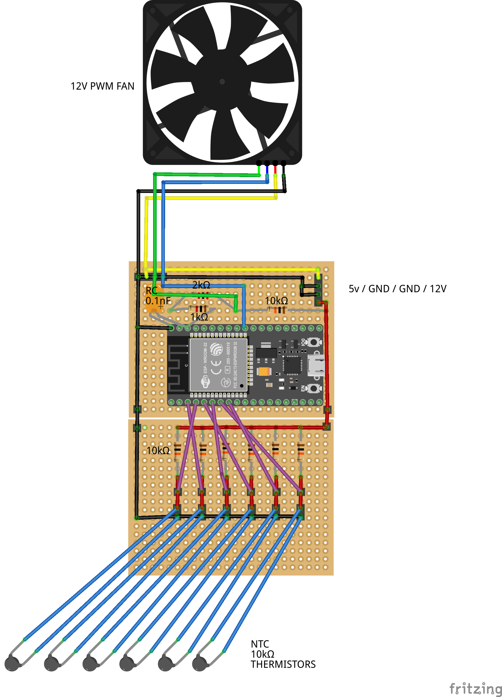

# esp32-mpy-pwm-fan-controller
MQTT-Enabled PWM Fan Controller with Thermistors and MicroPython on ESP32

# Status 
🚧 Work in progress – the project is currently being populated...

# Disclamer
I am a hobbyist and not a professional when it comes to electronics or programming. While I try to ensure accuracy, there may be mistakes or suboptimal choices in my work. Please use this as a learning resource, and feel free to offer corrections or suggestions for improvement!

# Background
The purpose of this repository is to document, share, and hopefully polish over time an ESP32-based MicroPython PWM fan controller using thermistors. I created this project to monitor the temperatures of up to six hard drives in my DIY NAS.

In most PCs, fans are controlled based on CPU or GPU temperatures, but that’s not ideal for managing HDD temperatures. In my NAS, the drives usually idle cool, but during operations like scrubs or backups—where several terabytes of data are read continuously—they start heating up. That’s where this controller comes in: it monitors HDD temps and ramps up dedicated fans as needed to keep them in a safe range.

The system publishes fan duty, RPM, and temperature readings over MQTT, allowing integration with platforms like Home Assistant for monitoring and automation.

# Schematics
[Fritzing schematic file](schematics/schematics.fzz)

# Parts list
* 1× ESP32 controller
* 1× 12V PWM fan (additional fans can be chained if they have compatible connectors)
* 6× 10kΩ NTC thermistor temperature sensors
* 7× 10kΩ resistors
* 1× 2kΩ resistor
* 1× 1kΩ resistor
* 1× 0.1 nF ceramic capacitor
* 1× 4-pin male fan connector
* 1× 4-pin male power supply connector (3-pin could also be used)
* 2× 18×24 hole prototyping PCB boards
* 1× SATA to Molex power adapter (Molex connector removed and wired directly to PCB power input)
* 24 AWG wire
* 1x aluminium tape (I believe it helps with heat transfer between hdd and sensor)

Comments:
* **Casing:** A casing is useful to facilitate handling the fully assembled project and prevent accidental shorts. I used an old external HDD casing, filled it with construction adhesive, and glued the assembled PCBs into it. After that, I waited a couple of weeks to ensure the adhesive had fully dried.
* **USB Access:** I had to cut one edge of the casing to connect a USB cable to the ESP32 for testing. This would have been easier to do before assembling the project.
* **Wires for Sensors:** For attaching the sensors, I used approximately 1m-long wires to ensure the sensors could reach anywhere in the PC case. However, with six sensors, the wires became quite a mess. It might have been smarter to use thinner wires and add connectors to the PCB so sensors not in use could be easily detached.
* **ESP32 Reset:** It would also have been helpful to include a cable with a reset button to easily reset the ESP32 without needing to restart the PC (if powered via SATA, as in my case).
* **Placement:** The placement of the project needs consideration. For example, the ESP32 will lose Wi-Fi connectivity if placed inside a metal PC case. It's better to choose a case with at least one plastic or glass side panel for better connectivity.
